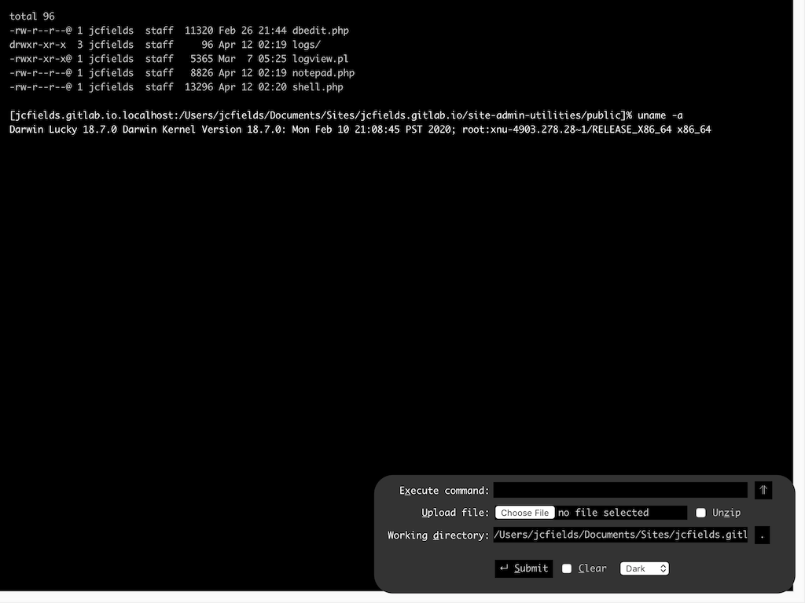

# site-admin-utilities

A few self-contained, basic utilities for site administration, useful for shared hosting servers where you may not have ssh access or the ability to install more fully featured tools. Written mostly in PHP 7 (with one utility written in Perl 5).

* `dbedit.php`, views and executes queries on SQLite databases.
* `logview.pl`, reads log files in a given directory.
* `notepad.php`, reads and writes text files.
* `shell.php`, provides a command-line for executing commands on the server.

These files were originally written around 2006, with minor updates over the years to use new language features and such. Since I made them for my own use, they are quite simple, even for their time. They use a request/reload model rather than XMLHttpRequests. The shell uses a bit of JavaScript fanciness to enable scrolling through the command history with the arrow keys and rudimentary tab-completion of file names for the current directory.

There is no authentication provided, since it is intended that one use Apache's built-in authorization through ".htaccess"/".htpasswd" files. Be careful not to deploy these files on a public-facing web server without some kind of access restriction in place since they provide access to any files accessible by the web server user.

The PHP scripts write to a log file when used. The web server user must have write access to the directory where logs are written (set by the `LOG_DIR` variable in each file) or logs must be disabled by setting the `LOG_NAME` variable to empty in each file.

## Authors

- J.C. Fields <jcfields@jcfields.dev>

## License

- [MIT license](https://opensource.org/licenses/mit-license.php)
